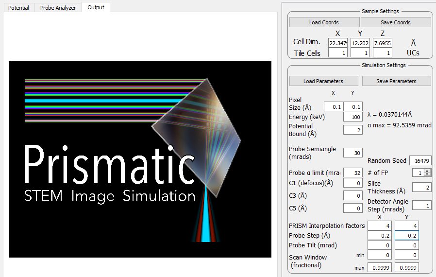
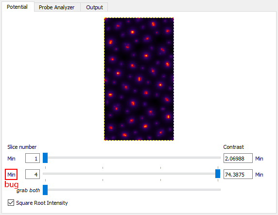
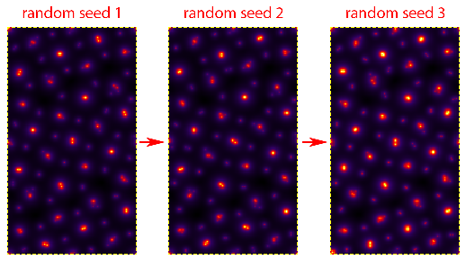
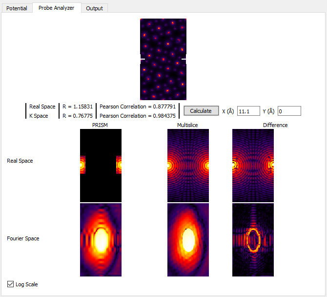
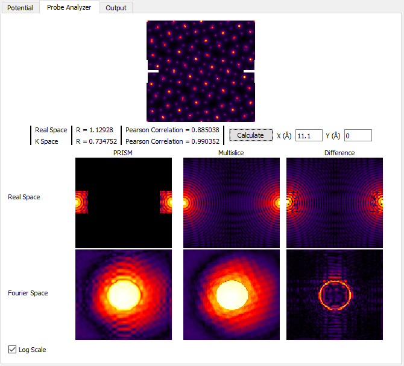
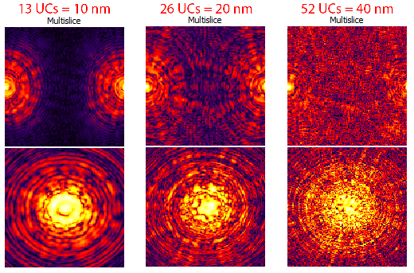
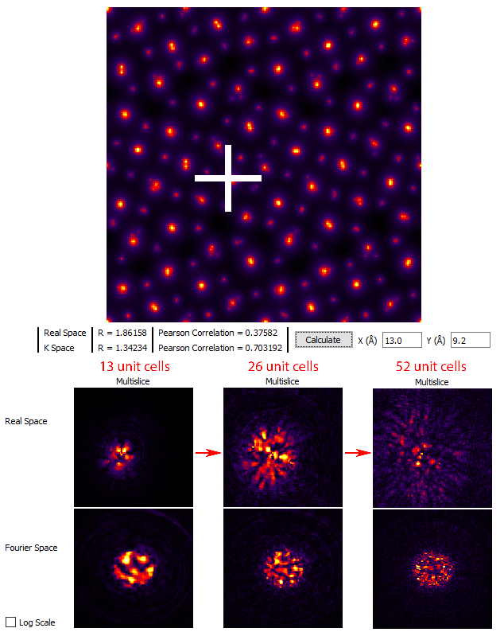

{:width="1184px"}

Instructors: Colin Ophus and Hamish Brown

## Table of Contents  
- [1 - Install `Prismatic`](#step1)
- [2 - Load atomic coordinates](#step2)
- [3 - Set microscope parameters](#step3)
- [4 - Projected atomic potentials](#step4)
- [5 - Unit cell tiling and `PRISM` accuracy](#step5)
- [6 - Run simulations](#step6)
- [7 - Save results](#step7)
- [8 - Further simulations](#step8)

&nbsp;

## 1 - Download and Install the `Prismatic` GUI.

The `Prismatic` GUI has been compiled for both Windows and OSX. For each of these operating systems, there are two possible versions of Prismatic you may wish to install.

### For Windows:

If your computer has an NVIDIA GPU that can run CUDA code, install:
[Prismatic-GPU-v1.1.msi](https://drive.google.com/open?id=1B9Yq-BBWY3VvNRD-aiKTWGzDME7s8qPh)

Otherwise, install:
[Prismatic-v1.1.msi](https://drive.google.com/open?id=13TZZc1ZAzMMx-cmfiCJCL4pBPqW_icWS)

### For OSX:

If you are running OSX 10.13.1 (High Sierra), install:
[Prismatic-OSX-v1.1.dmg (High Sierra)](https://drive.google.com/open?id=1OnclVmfDv9oIAXVdTbq6dp94DDiLuWfk)

If you are running OSX 10.12.6 (Sierra), install:
[Prismatic-OSX-v1.1.dmg (Sierra)](https://drive.google.com/open?id=1S1utdTErovvkf-o5P4gTRB5IeC4smYqZ)

The GPU portions of `Prismatic` were developed using CUDA. This means that Apple laptops and Mac desktops running AMD GPUs cannot make use of CUDA GPU code. However, the PRISM algorithm is quite fast. Therefore you may be able to run STEM simulations on Apple laptops in reasonable times. After downloading and installing `Prismatic`, run it to verify the installation has succeeded. At this stage, we will discuss the best settings for the number of GPU and CPU threads to use for best results in `Prismatic`.

&nbsp;

## 2 - Download coordinates, load into `Prismatic`.

The sample we are going to examine in this tutorial is barium neodymium titanate. This material has a complex unit cell, with the tungsten bronze parent structure. From this unit cell, we have constructed 5 different zone axes by projecting the unit cell into new pseudo-orthogonal unit cells. This methodology is described below.

`Prismatic` uses the same .xyz file format as Kirkland's computem software. We also assume the beam propagation direction is along the z axis. This file format contains 2 header lines, a comment and the cell dimensions (along x, y and z respectively). Next, the atom coordinates are listed in rows with these 6 column values:

1. atomic number
2. x 
3. y 
4. z 
5. occupancy 
6. RMS thermal vibration

Occupancy currently is assumed to be 1 for all atomic sites. The x, y, z, and RMS thermal vibration magnitude (root-mean-square atomic displacement) are all in units of Angstroms. Typical values for the RMS thermal displacements are 0.05 to 0.1 Angstroms.

For this tutorial, please download these five .xyz files:

[Barium Neodymium Titanate - [0 1 0] zone axis](data/barium_neodymium_titanate_0_1_0.xyz)

[Barium Neodymium Titanate - [0 2 1] zone axis](data/barium_neodymium_titanate_0_2_1.xyz)

[Barium Neodymium Titanate - [0 1 1] zone axis](data/barium_neodymium_titanate_0_1_1.xyz)

[Barium Neodymium Titanate - [0 1 2] zone axis](data/barium_neodymium_titanate_0_1_2.xyz)

[Barium Neodymium Titanate - [0 0 1] zone axis](data/barium_neodymium_titanate_0_0_1.xyz)

After downloading these files, load the first file ([0 1 0] zone axis) into `Prismatic` using the **Load Coords** button. The below screenshot shows what you should see after loading this file, specifically the unit cell dimensions along x, y and z:

{:width="960"}

You should see x, y and z cell dimensions of 22.3, 12.2, and 7.7 Angstroms respectively.

&nbsp;

## 3 - Microscope parameters and simulation settings.

In the following sections, I have highlighted each `Prismatic` setting using **bold red text**. This is to ensure that you can easily find the parameters used in this tutorial.

### Sample Settings:

Besides loading and saving, this settings box shows the cell dimensions and allows us to tile the unit cell along the three primary dimensions. Initially, we are going to skip over the **Tile Cells** settings, because they require very careful analysis to set correctly.

### Simulation Settings Block 1:

The first two buttons, **Load Parameters** and **Save Parameters** can save and load text files containing `Prismatic` settings. These files can be used in the GUI or command line versions of `Prismatic` and thus are very useful when submitting batch simulations.

The first setting, **Pixel Size**, is extremely important because it controls the high angle scattering accuracy of the simulation. This is because the pixel size 
 in real space defines the maximum inverse spatial coordinate value in Fourier space , using the formula:

`Prismatic` also includes a mathematical function to prevent an artifact called "aliasing" from occurring, which happens because of the periodicity assumption of the discrete Fourier transform. `Prismatic` uses an "anti-aliasing" aperture at 0.5 times the maximum scattering angle, which further reduces the maximum effective scattering angle by a factor of 0.5. This fact combined with the above equation and the formula 
 gives the maximum scattering angle  equation

where   is the relativistic electron wavelength. As an example, consider a case where we want to simulate 300 kV electron scattering angles up to 100 mrads. At 300 kV,  0.02 Angstroms. Plugging these values into the above equation gives

i.e. we require a 0.05 Angstrom pixel size  in order to reach a maximum scattering angle  of 100 mrads.

For this tutorial, we will use a **Pixel Size** value of **0.1 Angstroms** in order to save time, and we will set the accelerating voltage (in kV) using the **Energy** box to **100 kV**. Note that including these settings will immediately update the wavelength  and maximum scattering angle  displayed values to

 0.037 Angstroms

 92.5 mrads

The next value  **Potential Bound** specifies how far from the atomic core we will integrate the projected potentials. Set this value to **2 Angstroms** for reasonable accuracy.

### Simulation Settings Block 2:

The next set of parameters describe the values required to describe the incident converged electron probe. The semiangle of the probe specified by a condenser aperture is given by the **Probe Semiangle** box, which you should set to **30 mrads**. For the `PRISM` algorithm we also need to specify the **Probe  limit**, which corresponds to the maximum scattering angle computed for the Compact S-Matrix. This value should be set slightly larger than the **Probe Semiangle**, so we will use a value of **32 mrads** for the **Probe  limit**. 

The next three values are **C1**, **C3**, and **C5**, corresponding to defocus, and the first two orders of spherical aberration respectively. The convention used in `Prismatic` is a probe defined by

 

where

 

To keep this tutorial simple, we will assume an ideal microscope with no aberrations, where **C1 = C3 = C5 = 0**.

The next parameter value on the right side is the **Random Seed**, which is only used to make the simulation more repeatable for testing - thus we do not care what this value is set to for the purposes of this tutorial. The next value is the **# of FP**, which means "number of frozen phonon (FP) configurations." These multiple FP configurations are used to average the scattering pathways due to thermal motion of the atoms over multiple simulations. All high accuracy simulations should use multiple FPs, and typically the more the better. I recommend using (at a minimum) 8 FPs for thick samples, and 32 FPs for thin samples. For this tutorial, we will use **1 FP** configuration.

The next value is **Slice Thickness** which defines the spacing of potential slices used in the atomic potentials. A smaller value here will make the simulation more accurate, while a larger value will speed up the simulation. For this simulation we will use a typical value of **2 Angstroms**. The last value in this column is **Detector Angle Step**, which is used for the 3D simulation output to specify the width of each annular bin used in the output integration. The 3D output is a series of concentric rings for different scattering angles, recorded for each probe position. This value should be small enough to allow any necessary virtual detector to be constructed from the simulation. We will use the default value of **1 mrad**.

### Simulation Settings Block 3:

The final group of simulation settings deals with the `PRISM` interpolation factors, the STEM probe positions and tilts. We will be changing these settings later, but for now set **PRISM Interpolation Factors** to **4** for both x and y.  The spacing of STEM probes is set by the **Probe Step** box, which we will set to **0.2 Angstroms**. **Probe Tilt** should be set to **0 mrads** for both x and y, and the **Scan Window** should run from **0 to 0.9999** for both x and y. This will create a square grid of STEM probes that will cover the entire field of view. The reason to not set the maximum range to 1.0 is that if the probe step can be evenly divided into the simulation cell size, we would duplicate the probe located at 0.0 with the probe located at 1.0, due to the periodicity of the simulation.

Note that it is very important to remember the difference between **Pixel Size** and **Probe Step** settings, both in units of Angstroms. The **Pixel Size** setting refers to the sampling of pixels for the atomic potentials, the STEM probes, and the various numerical operator functions used during the simulation. By contrast, **Probe Step** refers only to the spacing of the STEM probes, and no other parts of the simulation. Later in the tutorial, we will for example run simulations consisting of only single STEM probe positions.

Now that you have entered the basic settings, your window should look like so:

{:width="898"}

&nbsp;

## 4 - Calculate and view atomic potentials.

We can now start using `Prismatic` interactively, to determine the remaining settings for our simulation. This section will show you why it is very important to visualize your STEM simulation components, whether you are using the `PRISM` or `multislice` algorithms. Running a simulation blindly over a console (the first time) can easily cause you to overlook potential issues.

The first part of a STEM simulation is calculation of the atomic potentials. You can always run this part of the STEM simulation independently in `Prismatic`, by clicking on the **Calculate Potentials** button at the bottom the right hand side of the GUI. This should take only a few moments of CPU time. Next, select the **Potential** tab on the upper left corner. You will immediately see the first potential slice.  To see the sum of all slices, select the **Max** slider bar on the lower left and drag it all the way to the right, giving a slice range from 1 to 4 slices [***Bug*** - both sliders are labeled **Min**, but the lower one refers to **Max**]. To make it easier to view the potentials, you can next click on the **Square Root Intensity** check box. Your window should now look like this:

{:width="572"}

Note that the individual atomic columns do not form round peaks - why?  The answer is two-fold: first, what you are seeing is the randomly generated atomic displacements due to thermal motions (Debye-Waller effect). Relativistic electrons move **much** faster than ions in solid materials. To the electron beam, the ions appear to have (semi) random shifts "frozen" in, due to the large number of of phonons present in the material at any given time. Technically speaking, each electron will see a different frozen phonon configuration, but simulating this is impractical. Instead we use a number of "frozen phonon (FP) configurations" and sum the results incoherently. To see this in action, try changing **Random Seed** to different values, and then clicking on **Calculate Potentials** again.  For example on my laptop, changing the seed value gives these potentials:

{:width="518"}

There is a second reason why these shifts are so obvious - because the sample is extremely thin (<8 Angstroms). Because we are not yet tiling the cell along the beam direction, each atomic column has only a small number of atoms along the beam direction.  This is why more FP configurations are needed when running a simulation of a thin sample. Thicker samples will "average out" the atomic shifts to a greater degree. Note that all simulations used for quantitative analysis should still use multiple FP configurations, and more will always be more accurate. However we should also remember that we are not truly modeling the thermal motion of phonons inside a sample when we use random atomic shifts. Including correlations of the phonon wavevectors requires a much more accurate set of atomic positions, for example those calculated using molecular dynamics.

&nbsp;

## 5 - Determine unit cell tiling, and examine `PRISM` accuracy.

The first problem with the simulation is that the cell is far too small, especially along the horizontal direction. Even a sub-Angstrom STEM probe will have tails reaching a diameter of 1 nm. Thus we must prevent wraparound errors due to periodicity, where the probe tails self-interact. `Prismatic` includes a build in tool to examine these possible issues, and you can reach it by clicking on the **Probe Analyzer** tab in the upper left.

The **Probe Analyzer** will compute STEM probes using both the `PRISM` and `multislice` algorithms. It consists of a few steps: first, specify where you want to place the test STEM probe. Here we will use **x = 11.1, y = 0 Angstroms** for the initial test (middle of the left panel of the GUI). After specifying these settings, click on the **Calculate** button right next to the x,y position boxes. To better see the probe intensity, click on the **Log Scale** check box. You should see:

{:width="670"}

For now, ignore all of the panels except for the very center one, **Real Space Multislice**.  You can see where the STEM probe is located, halfway down the left and right edges (periodicity). In the middle of this panel, we see an interference pattern in the STEM probe due to this wraparound effect. To get rid of this artifact, we can tile the unit cell horizontally by changing **Tile Cells Y** from 1 to **2 unit cells**. Next, recompute the STEM probe tests by clicking on **Calculate** in the middle of the left panel. You should see:

{:width="670"}

As you can see, the self-interference of the STEM probe is much reduced. Generally for atomic resolution simulations, I suggest unit cell dimensions of at least 20 Angstroms. However as we will see next, this guideline is often insufficient for thick simulation cells. The probe may start out fitting inside a 20 Angstrom cell, but after propagating some distance it can expand bue the large convergence semiangle and scattering from the atomic columns. We will now examine this effect. In order to speed up these calculations, first set the **PRISM Interpolation Factors** to **10**. Next, create a 100 Angstrom simulation cell thickness by changing **Tile Cells Z* to **13 unit cells**. Then click **Calculate** and look at the **Real Space Multislice** panel. You can also try setting **Tile Cells Z* to **26 unit cells** for a 200 Angstrom thick simulation, or  **52 unit cells** for a 400 Angstrom simulation thickness. See below:

{:width="520"}

However we should keep in mind that **Log Scale** intensity range does not necessarily give us a good idea of how much intensity of the STEM probe is actually present at some distance from the nominal probe position. But, the current STEM probe position is not representative of a "worst case scenario," where the probe scattering is maximized. To address both of these issues, first uncheck the **Log Scale** box and then move the STEM test probe to **x = 13.0, y = 9.2 Angstroms**. Once again, try setting **Tile Cells Z** set to **13, 26 and 52 unit cells**, clicking **Calculate** after each change. You will see the probe become more delocalized as the sample becomes thicker: (this image is not a direct representation of the GUI window)

{:width="634"}

&nbsp;

## 6 - Run simulations using the `PRISM` algorithm.
text

&nbsp;

## 7 - Save simulation results, save output images.
text

&nbsp;

## 8 - Further simulations.
text

